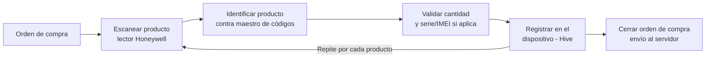
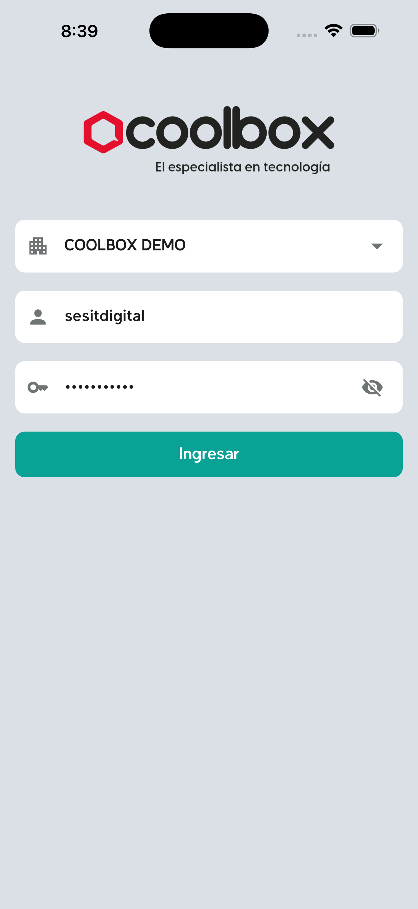
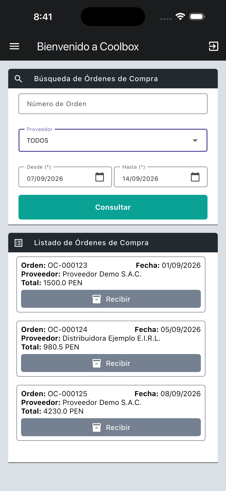
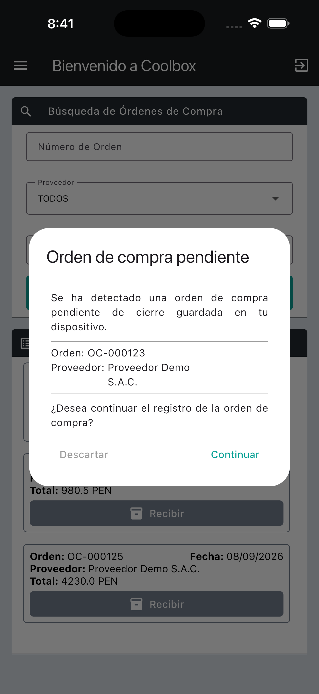
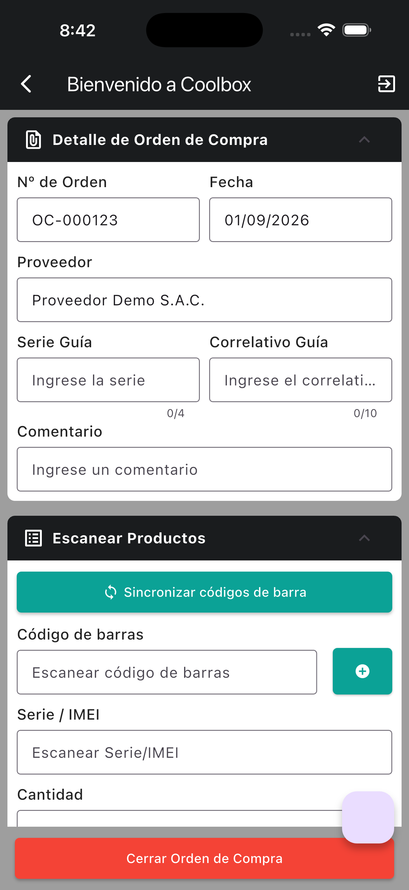
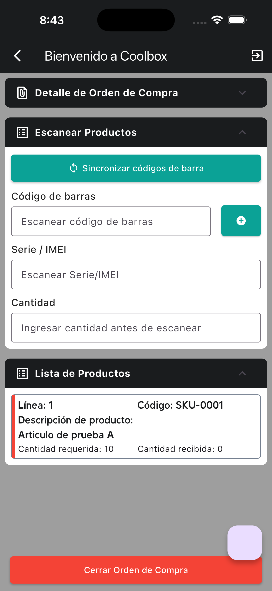
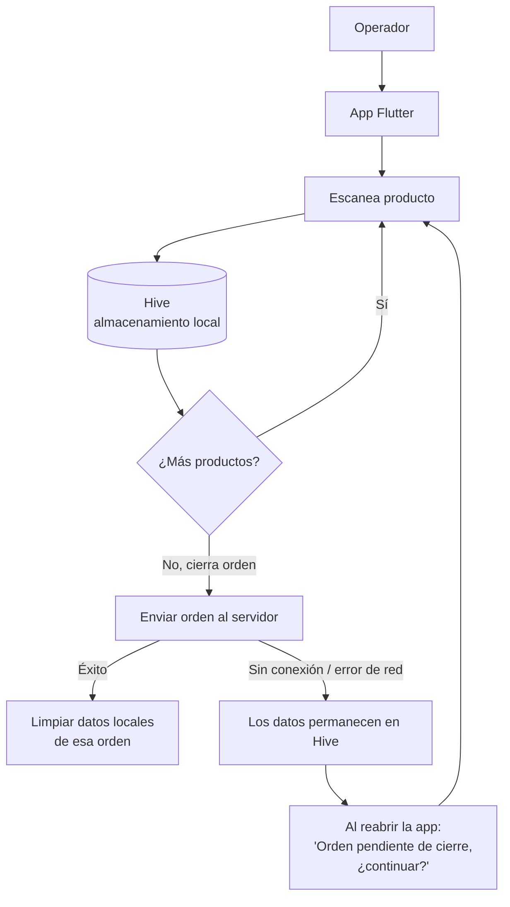
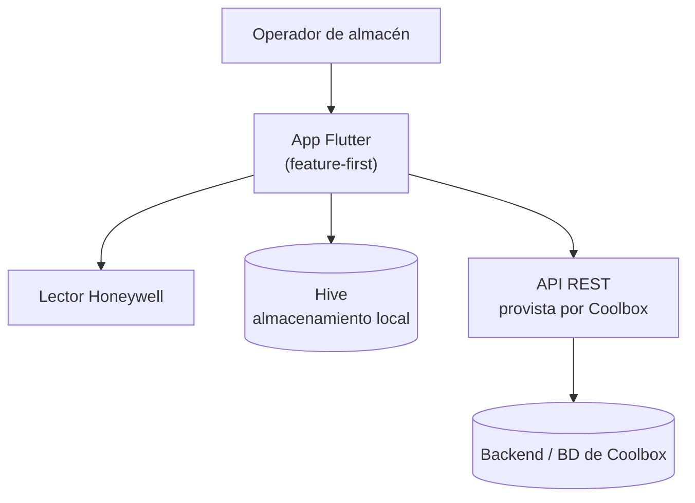

# COCO COOLBOX 

Aplicación móvil multiplataforma (Android/iOS) para operaciones de almacén de Coolbox, orientada al registro y validación de productos asociados a órdenes de compra mediante escaneo de códigos de barras, con soporte para escenarios de conectividad intermitente.

📲 App publicada en Google Play: [com.coolbox.coco](https://play.google.com/store/apps/details?id=com.coolbox.coco)

> **Proyecto empresarial — código propietario.**
> Desarrollé esta aplicación completa a través de la consultora Software Enterprise Services (SES/Sesit Digital), para su cliente Coolbox. El código es propiedad del cliente y no puede publicarse. Este repositorio es un **case study de documentación**: explica arquitectura, flujos y mi contribución, sin código fuente real ni datos de negocio reales.

---

## Índice

1. [Resumen](#resumen)
2. [Problemática](#problemática)
3. [Solución](#solución)
4. [Flujo principal](#flujo-principal)
5. [Funcionamiento offline](#funcionamiento-offline)
6. [Mi participación](#mi-participación)
7. [Arquitectura](#arquitectura)
8. [Stack tecnológico](#stack-tecnológico)
9. [Confidencialidad](#confidencialidad)

---

## Resumen

COCO COOLBOX es la app móvil que usan los operadores de almacén de Coolbox para recibir mercadería contra órdenes de compra: buscan la orden, escanean los productos con un lector de código de barras, registran la cantidad recibida (y el número de serie/IMEI cuando aplica), y cierran la orden. Desarrollé la aplicación completa en Flutter, incluyendo el diseño offline-first que permite seguir escaneando productos aunque el dispositivo pierda conectividad dentro del almacén.

## Problemática

Los operadores de almacén de Coolbox necesitaban registrar el ingreso de mercadería contra órdenes de compra de forma ágil desde el propio almacén: identificar cada producto recibido, validarlo contra lo solicitado en la orden, y dejar registrada la cantidad recibida (y, para productos serializados, el número de serie o IMEI).

Ese proceso implica revisar múltiples productos por orden, en un entorno físico (almacén) donde la conectividad de red puede ser limitada o intermitente en determinadas zonas. Se necesitaba una aplicación móvil que permitiera continuar el proceso de recepción sin depender de tener conexión en todo momento, y sincronizar la información una vez recuperada la conectividad.

## Solución

COCO COOLBOX aborda esto con:

- Consulta de órdenes de compra pendientes de recepción, con filtros por proveedor y rango de fechas.
- Identificación de productos mediante lectura de código de barras (lector físico Honeywell).
- Registro de cantidad recibida por producto, con soporte para productos serializados (número de serie/IMEI).
- **Diseño offline-first**: cada escaneo se guarda de inmediato en almacenamiento local (Hive), sin depender de la red — el envío al servidor ocurre en un paso explícito de "Cerrar Orden de Compra".
- Recuperación automática de una orden que quedó a medio registrar en el dispositivo (por cierre inesperado de la app, por ejemplo), preguntando al operador si desea continuar donde quedó.

## Flujo principal

| 1. Login | 2. Búsqueda de órdenes | 3. Orden pendiente (offline) |
|---|---|---|
|  |  |  |

| 4. Detalle y escaneo | 5. Lista de productos |
|---|---|
|  |  |

*Datos ficticios (`COOLBOX DEMO`, `Proveedor Demo S.A.C.`, `SKU-0001`). La captura 3 es evidencia directa del diálogo de recuperación de orden pendiente descrito en la siguiente sección.*

## Funcionamiento offline

> Diagrama ajustado al comportamiento real encontrado en el código — no hay una detección proactiva de conectividad; la app siempre escribe primero en local, y el envío al servidor es una acción explícita que puede fallar y reintentarse.

Puntos verificados directamente en el código (detalle completo en [`docs/desarrollo.md`](docs/desarrollo.md)):
- Cada escaneo (`registerProduct`) actualiza el registro **solo en Hive**, sin ninguna llamada de red — por eso escanear funciona igual con o sin conexión.
- El maestro de códigos de barras también se descarga y cachea en Hive, para que la identificación del producto funcione sin conexión una vez sincronizado.
- No hay una librería de detección de conectividad (`connectivity_plus` u otra): la app detecta la falta de red al intentar el envío final, capturando específicamente un `SocketException` para mostrar "No hay conexión a internet".
- Al reabrir la app con una orden guardada localmente y sin cerrar, se muestra un diálogo ("Orden de compra pendiente de cierre") para continuar el registro donde quedó — lo confirmé en captura real de la app (ver `screenshots/`).
- Al cerrar exitosamente la orden, los datos locales de esa orden se eliminan de Hive.

## Mi participación

Desarrollé la aplicación COCO COOLBOX completa en Flutter, como desarrollador principal a través de SES/Sesit Digital para su cliente Coolbox. Esto incluye la arquitectura de la app, las pantallas, la lógica de negocio del lado del cliente, la persistencia local con Hive y el diseño offline-first del flujo de recepción de mercadería.

**Lo que no desarrollé:** la API/backend que consume la app — Coolbox entregó la documentación de sus servicios (contratos de request/response) para que la app se integrara contra ellos; no participé en el desarrollo de ese backend.

*(La app incluye además un módulo de "Devolución 1 Click" visible en una de las capturas, que no llegué a auditar a nivel de código en esta revisión — no incluyo detalle técnico de ese módulo por no tener esa verificación.)*

## Arquitectura

Detalle de capas, patrones y manejo de estado en [`docs/arquitectura.md`](docs/arquitectura.md).

## Stack tecnológico

- Flutter
- Dart
- BLoC/Cubit (`flutter_bloc`)
- Dio
- Hive / `hive_flutter`
- Freezed
- `json_serializable`
- Honeywell Scanner SDK
- Lottie
- `pretty_dio_logger`
- Git

## Confidencialidad

COCO COOLBOX es propiedad de Coolbox (cliente de SES/Sesit Digital). Este repositorio:

- No contiene código fuente real de la app.
- No contiene endpoints, dominios, IPs, tokens ni credenciales reales.
- No contiene datos reales de proveedores, órdenes de compra, montos ni información de negocio de Coolbox.
- Toda captura mostrada usa datos ficticios (`COOLBOX DEMO`, `Proveedor Demo S.A.C.`, `Distribuidora Ejemplo E.I.R.L.`, `SKU-0001`).
- Todo diagrama es conceptual, construido a partir de mi propia lectura del código, sin nombres de servicios ni contratos reales.
